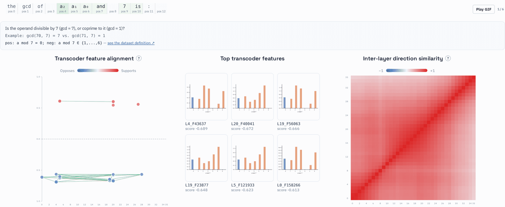

# Mechanistic Circuits and Concept Representation in Qwen3-4B

<p align="center">
  <a href="https://github.com/JuliaDima/mechinterp-qwen3/actions/workflows/ci.yml"></a>
  <a href="https://opensource.org/licenses/MIT"></a>
  <a href="https://mechinterp-viz-94c364.uniofcam.dev/"></a>
</p>

This is a mechanistic interpretability project for the instruction-tuned open-source model **Qwen3-4B**, built around a contrastive residual-stream method for studying **concept representation**: how a binary concept — a contrastive predicate the model must resolve as it reads a prompt — is encoded across layers, tokens, and anchor positions. The set of concepts covered is intentionally growing; see [Concept Localisation](#concept-localisation) below for where they're defined.

For each concept, matched positive/negative prompt pairs isolate a single computational predicate. The pipeline computes layerwise residual-stream delta trajectories between matched pairs, compares them against a permutation-null baseline to establish where the signal is statistically distinguishable from chance, validates candidate anchor positions by activation patching, and projects the resulting directions onto sparse transcoder features to identify which specific features carry the concept and how consistent that direction is across depth.

The concepts and attribution graphs can be explored at [https://mechinterp-viz-94c364.uniofcam.dev/](https://mechinterp-viz-94c364.uniofcam.dev/).

<p align="center">
  
  <br>
  <sub><em>The animation shows concept localisation for GCD divisibility. Each frame steps to the next anchor position (ranked by contrastive signal strength as the model reads the prompt) and shows the transcoder features most aligned with the divisibility direction at that position, their individual activation profiles (x-axis shows `a mod 7` feature activations), and how the residual-stream direction stabilises across layers. </em></sub>
</p>

The visualiser is designed for inspecting how a contrastive predicate emerges as the model consumes a prompt, and for connecting the residual-stream geometry to sparse transcoder features and attribution-supported feature constellations.

- **Prompt timeline**: highlights the token position used as the current anchor.
- **Transcoder feature alignment**: shows top transcoder features aligned with the contrastive direction (opposing vs. supporting) and repeated feature-to-feature connections.
- **Delta trajectory and permutation null**: shows the raw and double-normalised residual-stream delta across model layers, and the excess of the observed signal above a permutation-null baseline.
- **Inter-layer direction similarity**: a layer-by-layer cosine-similarity heatmap of the delta directions, showing how quickly the anchor direction stabilises across depth.
- **Feature detail**: clicking a feature in the constellation opens its own activation-profile plot (mean positive/negative activation per modular input, or a 2D activation map).

### Other experiments

**Attribution graph generation is also part of the pipeline (as a reproduction experiment)**: gradient-based circuit discovery through sparse transcoder features, following the *Attribution Graphs* methodology from [*On the Biology of a Large Language Model*](https://transformer-circuits.pub/2025/attribution-graphs/biology.html) (Lindsey et al., 2025). It is used for two case studies included in this repository — two-digit addition (attribution graphs, operand-grid feature scans, teacher-forced accuracy analysis) and multilingual antonym circuits (intervening on operation, operand, and output-language features across English, Chinese, and French) — and is available as a general-purpose tool for any prompt. 

The visualiser also provides an interactive view of the attribution graph for an input prompt. [Here](https://mechinterp-viz-94c364.uniofcam.dev/?conceptRun=%2Fdata%2Fcarry_T0.json) is an example for the addition dataset.

## Table of Contents

- [Data Availability](#data-availability)
- [Installation](#installation)
- [Usage](#usage)
  - [Concept Localisation](#concept-localisation)
  - [Attribution Graphs](#addition-attribution-graphs)
  - [Multilingual Antonym Interventions](#multilingual-antonym-interventions)
  - [Batch Attribution Graph Jobs](#batch-attribution-graph-jobs)
- [Model and Transcoders](#model-and-transcoders)
- [License](#license)
- [Authors and Acknowledgment](#authors-and-acknowledgment)

---

## Installation

### Requirements

- Python 3.11 or higher
- Conda (for environment management)
- CUDA-capable GPU (required for inference; plotting/export runs on CPU)

### Setup

1. **Clone the repository:**

    ```bash
    git clone https://github.com/JuliaDima/mechinterp-qwen3.git
    cd mechinterp-qwen3
    ```

2. **Create and activate the environment:**

    ```bash
    conda create -n mechinterp python=3.11 -y
    conda activate mechinterp
    ```

3. **Install the package:**

    ```bash
    pip install -e ".[docs,test]"
    ```

4. **Set HuggingFace Hub to offline mode** (if using cached weights on HPC):

    ```bash
    export HF_HUB_OFFLINE=1
    export TRANSFORMERS_OFFLINE=1
    ```

---

## Usage

### Concept Localisation

Finds where and how a contrastively specified concept is encoded across layers and token positions, using residual-stream deltas projected onto transcoder features.

Concept dataset definitions (arithmetic, logic, physics, and language concepts) live under
[`experiments/concept_localization/concept_datasets/`](https://github.com/JuliaDima/mechinterp-qwen3/tree/main/experiments/concept_localization/concept_datasets) — that directory is the current, growing list.

#### Run a single concept

```bash
# Full pipeline (GPU required — submit via Slurm)
python -m experiments.concept_localization.pipeline.run_concept \
    --concept carry
```

Output is found in `runs/concept_localization/{concept}/`.

#### Run several concepts in a batch

```bash
for concept in carry gcd; do   # replace with whichever concepts you want to (re)generate
    sbatch scripts/sbatch_run.sh python -m experiments.concept_localization.pipeline.run_concept \
        --concept $concept
done
```

#### Plot per-anchor summary grids (CPU, no GPU needed)

```bash
python -m experiments.concept_localization.plots.plot_emergence_per_anchor \
    --concept carry --template T0 --top_k 6 --thesis
```

#### Visualiser exports

Committed visualiser exports live under `data/*.concept.json` and `viz/data/*.json`, one file per bundled concept following the pattern `{concept}_T0.concept.json` / `{concept}_T0.json`. These are lightweight summaries of the larger run directories on RDS and contain prompt tokens, anchor trajectories, null baselines, top transcoder features, and feature-constellation edges.

---

### Addition Attribution Graphs

Builds node-ablation attribution graphs and recovers lookup-like addition circuits.

```bash
miq attribute -t mwhanna/qwen3-4b-transcoders -p "calc: 36+59=" \
    --slug addition_36_59 --graph_file_dir graphs/
```

### Multilingual Antonym Interventions

Tests whether operation, operand, and output-language components can be independently suppressed and injected across English, Chinese, and French. The experiment code is under `experiments/multilingual_circuits/`.

### Batch Attribution Graph Jobs

```bash
python scripts/submit_concept_attribution_graphs.py
```

---

## Model and Transcoders

- **Model**: `Qwen/Qwen3-4B` — 36 transformer layers, d\_model = 2560, 32 attention heads (8 KV heads), RoPE positional encoding, instruction-tuned
- **Transcoders**: `mwhanna/qwen3-4b-transcoders` — one sparse autoencoder per MLP layer, trained to reconstruct MLP output in terms of interpretable features; accessed via `AttributionModel.transcoders[layer]`

---

## License

This project is licensed under the [MIT License](https://opensource.org/license/mit/) — see the [LICENSE](LICENSE) file for details.

---

## Authors and Acknowledgment

Developed by [Elisabeta-Iulia (Julia) Dima](mailto:eid23@cam.ac.uk), supervised by Dr Miles Cranmer and Dr Alessandro Favero at the Department of Applied Mathematics and Theoretical Physics, University of Cambridge.
