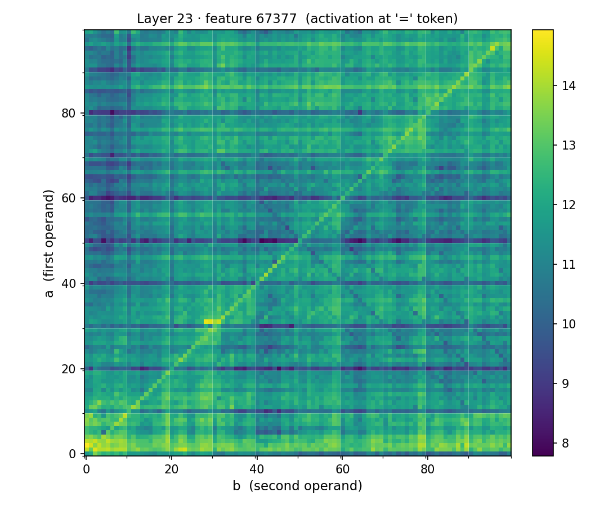

Carry Discovery (Addition Case Study)
=====================================

This module reproduces the addition mechanistic interpretability case study from Anthropic's "On the Biology of a Large Language Model" (Transformer Circuits Thread, 2025). The goal is to discover and validate the "circuits" that a model uses to perform arithmetic, specifically focusing on how it handles **carries**.

Scientific Context
------------------

Anthropic's research found that while models can explain human-like carry addition in natural language, their internal circuits often resemble **modular arithmetic lookup tables**. This case study reproduction provides the tools to verify these findings on the Qwen3-4B model.

.. important::
   **Teacher Forcing is NOT Used in Circuit Discovery**

   The carry discovery experiments use:

   - **Gradient-based attribution**: Computing which features contribute to the output logit
   - **Causal interventions**: Activation patching and feature inhibition to test causality

   Neither technique requires teacher forcing. All forward passes use only the prompt
   (e.g., ``"calc: 36+59="``) without ground-truth answer tokens. Attribution is computed
   from the logit of the correct answer token, not from generating multiple tokens.

   Teacher forcing is available separately in the ``dataset_generation`` module for
   exploratory behavioral analysis only.

Experimental Protocol
---------------------

The reproduction consists of five distinct phases, orchestrated by the ``experiments/addition/run.py`` script.

**Best Practice**: Always run the accuracy sweep first to verify the model actually solves the task!

0. Accuracy Sweep (RECOMMENDED FIRST)
~~~~~~~~~~~~~~~~~~~~~~~~~~~~~~~~~~~~~

Before attempting circuit discovery, verify that the model genuinely solves addition on your
chosen prompt format. This phase:

1. **Checks tokenization**: Verifies how answers split into tokens (e.g., "95" → ["9","5"] or ["95"])
2. **Runs accuracy sweep**: Tests greedy decoding on all ``calc: a+b=`` prompts for a,b ∈ [0,99]
3. **Filters verified prompts**: Selects only prompts where model's argmax matches ground truth

.. code-block:: bash

   python experiments/addition/accuracy_sweep.py --all --quick

**What to look for**:

- **High accuracy (>80%)**: Model solves the task, proceed with circuit discovery
- **Low accuracy (<80%)**: Change prompt format (spacing, few-shot, "Answer:", etc.) before analyzing circuits
- **Tokenization issues**: Multi-token answers may require special handling

**Output**:
- ``tokenization.json``: How each answer tokenizes
- ``accuracy_sweep.json``: Detailed results for all prompts
- ``verified_prompts.txt``: List of prompts where model is correct (use for downstream analysis)

.. important::
   **Why this matters**: If the model doesn't perform carry addition, there's no carry circuit
   to discover. You should only analyze circuits on prompts where the model actually solves
   the task (conditioning on correct cases).

1. Prompt Suite Generation
~~~~~~~~~~~~~~~~~~~~~~~~~~

The suite comprises ~10,000 prompts in the format ``"calc: {a}+{b}="`` for all :math:`a, b \in \{0, \dots, 99\}`. This grid allows for comprehensive mapping of model activations across the entire 2-digit addition space.

.. code-block:: bash

   python experiments/addition/run.py --make-prompts

2. Operand Plots (Behavioral Mapping)
~~~~~~~~~~~~~~~~~~~~~~~~~~~~~~~~~~~~~

For every feature $f$ in a transcoder, we generate a 100×100 heatmap where the value at $(a, b)$ is the feature's activation at the ``=`` token position.

**Patterns to look for:**

*   **Vertical/Horizontal bands**: Sensitivity to a single operand.
*   **Diagonal stripes**: Encoding the sum :math:`a+b`.
*   **Repeating Mod-10 grids**: Modular arithmetic (ones/tens digit encoding).
*   **Isolated points**: Lookup table entries for specific number pairs.

.. code-block:: bash

   python experiments/addition/run.py --operand-plots

3. Attribution Graph Construction
~~~~~~~~~~~~~~~~~~~~~~~~~~~~~~~~~

We build a pruned computational graph for a specific focus case (default: ``36+59=95``). The graph attributes influence from the output logit back through transcoder features to the input.

**How it works (without teacher forcing)**:

1. Run a single forward pass on ``"calc: 36+59="`` (prompt only, no answer)
2. Compute gradients with respect to ``logits[-1, token_id_for_"9"]`` (the correct first digit)
3. Trace attributions backward through transcoder features to identify which features contribute to the output
4. Build a graph showing feature-to-feature influence

**Supernode Proposal**: The system automatically groups features into "supernodes" based on their activation patterns and attribution scores, matching the "ones digit lookup", "tens carry", etc., labels from Anthropic's work.

.. code-block:: bash

   python experiments/addition/run.py --graph

4. Intervention Validation (Constrained Patching)
~~~~~~~~~~~~~~~~~~~~~~~~~~~~~~~~~~~~~~~~~~~~~~~~~

To prove a feature is truly part of a circuit, we perform **constrained patching**. We clamp the activations to a "perturbed" run (e.g., ``36+60=``) up to an intervention layer, then inhibit specific features and measure the effect on the final logit.

**Causal intervention methodology (not teacher forcing)**:

1. Run perturbed prompt ``"calc: 36+60="`` and cache activations at each layer
2. Run clean prompt ``"calc: 36+59="`` but replace activations at early layers with those from the perturbed run
3. Inhibit (zero out) specific features at the intervention layer
4. Measure change in the output logit for token ``"9"``

This tests **causality**: if inhibiting a feature changes the output, that feature is causally important.
No ground-truth answer tokens are provided to the model—we only measure changes in logits.

.. code-block:: bash

   python experiments/addition/run.py --intervene

Implementation Details
----------------------

Position Alignment
~~~~~~~~~~~~~~~~~~

The critical activation position is the **last token of the prompt** (the ``=`` token). This is where the model has processed the operands and is preparing to produce the first digit of the answer.

Feature Naming
~~~~~~~~~~~~~~

Features are identified by their layer and local index (e.g., ``L12_F543``). The ``operand_plots_summary.json`` provides a rank-ordered list of features by activation strength.

Reproduction Differences
------------------------

While the protocol is as faithful as possible, there are key differences from the original Anthropic study:

*   **Model**: Qwen3-4B uses a different tokenizer than Anthropic's internal models. One-token vs. multi-token answers are handled in ``expected_answers.py``.
*   **Transcoders**: We use Per-Layer Transcoders (PLTs), resulting in longer attribution paths than the cross-layer transcoders used by Anthropic.

Faithfulness across Formats
---------------------------

The module compares the "structured" circuit (``calc: 36+59=``) with "natural language" variants (``What is 36+59? Answer:``). This tests whether the same internal circuit is reused regardless of the input surface format.

Recommended Workflow
--------------------

Follow these steps for robust circuit discovery:

.. code-block:: bash

   # Step 0: ALWAYS start with accuracy sweep
   python experiments/addition/accuracy_sweep.py --all --quick

   # Check the results:
   # - If accuracy > 80%: proceed to next steps
   # - If accuracy < 80%: modify prompt format and re-run accuracy sweep

   # Step 1-4: Run full circuit discovery pipeline
   python experiments/addition/run.py --all

   # Or run individual phases:
   python experiments/addition/run.py --make-prompts
   python experiments/addition/run.py --operand-plots
   python experiments/addition/run.py --graph
   python experiments/addition/run.py --intervene

**Filtering to verified prompts**: After running the accuracy sweep, you can use the
``verified_prompts.txt`` file to restrict your analysis to only prompts where the model
is correct. This ensures you're discovering circuits for successful computation, not
error modes.

Usage Guide
-----------

For detailed CLI options and log output descriptions, see the project's root ``config.yaml``.

Feature Selection and Naming
-----------------------------

Feature Discovery (Top-K)
~~~~~~~~~~~~~~~~~~~~~~~~~~

When ``--operand-plots`` runs without an explicit feature list, it performs a
**discovery pass** on the focus prompt (default: ``"calc: 36+59= "``).  The
model is run once and all non-zero SAE feature activations at the ``=`` token
position are collected across all layers.  These are sorted globally by
activation value (descending) and the top ``top_k_global`` (default **50**)
are selected for plotting.

Because features from later layers tend to have larger raw activation values,
the selected set is typically concentrated in the final layers (L23–L35 for
Qwen3-4B).

Feature Naming Convention
~~~~~~~~~~~~~~~~~~~~~~~~~~

Each plot is saved as ``L{layer:02d}_F{feat_idx:06d}.png``.  For example:

* ``L23_F067377`` — layer **23**, feature index **67,377** (out of 163,840).
* ``L31_F035637`` — layer **31**, feature index **35,637**.

The six-digit zero-padded feature index is the position in that layer's SAE
weight matrices (``W_enc``, ``W_dec``, ``b_enc``), all of shape
``(d_transcoder, ...)`` with ``d_transcoder = 163,840`` for Qwen3-4B.

The ``operand_plots_summary.json`` written alongside the images contains the
full ranked list with ``max_activation`` and ``mean_activation`` over the
100×100 grid, which can be used to prioritise features for manual inspection.

Example: ``L23_F067377``
~~~~~~~~~~~~~~~~~~~~~~~~

   **L23_F067377** — a sum-sensitive feature (layer 23, feature 67,377).
   The bright diagonal stripe shows that activation peaks when :math:`a + b`
   is small (bottom-left corner), and the repeating horizontal/vertical bands
   reflect sensitivity to the individual operands' ones-digit values.  This
   feature was the highest-ranked on the focus prompt ``"calc: 36+59= "``.
