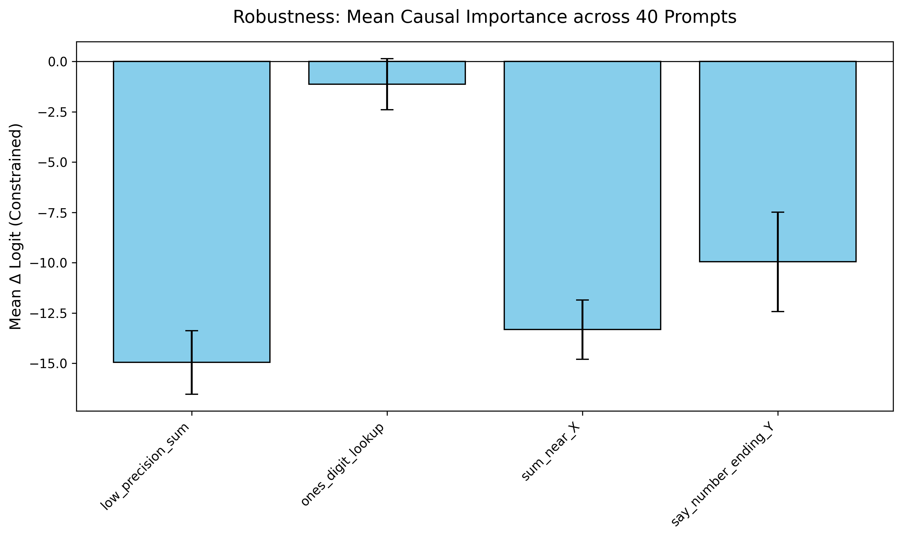
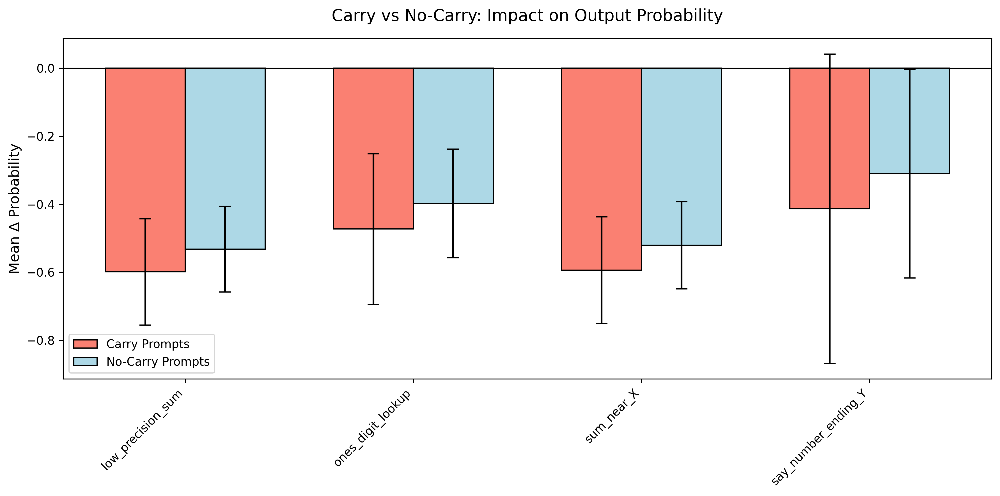

Robustness Experiment (Circuit Stability)
=========================================

The **Robustness Experiment** module is designed to test whether the discovered arithmetic circuitry generalizes across many different mathematical prompts, rather than just one specific example. This serves as a critical validation step for "carry" operations.

Scientific Context
------------------

Finding a circuit for a single prompt like ``36+59=95`` is useful, but the true test of a mechanistic explanation is whether the same components fire consistently across a wide distribution of inputs.

This experiment leverages **causal interventions** (activation patching) to perturb the carry condition across 40 different addition prompts, measuring whether the hypothesized functional groups (e.g., ``low_precision_sum``, ``ones_digit_lookup``) maintain their expected influence on the final logit.

Experimental Protocol
---------------------

The robustness script (``experiments/addition/robustness_experiment.py``) automatically handles the dataset generation, attribution mapping, and causal interventions required to test stability.

1. Dataset Generation
~~~~~~~~~~~~~~~~~~~~~

The script generates 40 unique prompt pairs:

-   **20 "Carry" Base Prompts**: e.g., ``28+17=`` (where :math:`8+7 \ge 10`).
-   **20 "No-Carry" Base Prompts**: e.g., ``28+11=`` (where :math:`8+1 < 10`).

For every base prompt, a **perturbed counterpart** is crafted to specifically flip the carry condition while keeping the tens digit identical. This isolates the effect of the carry mechanism:

*   **Carry to No-Carry Perturbation**:
    The ones digit of ``b`` is forced to ``0``:

    .. code-block:: python

       b_perturb = (b // 10) * 10

    Since the maximum possible ones digit for ``a`` is ``9``, adding ``0`` guarantees :math:`a_{\text{ones}} + 0 \le 9`, perfectly creating a no-carry condition.

*   **No-Carry to Carry Perturbation**:
    The ones digit of ``b`` is forced to ``9``:

    .. code-block:: python

       b_perturb = (b // 10) * 10 + 9

    As long as :math:`a_{\text{ones}} \ge 1`, adding ``9`` guarantees :math:`a_{\text{ones}} + 9 \ge 10`, perfectly creating a carry condition.

2. Execution Pipeline
~~~~~~~~~~~~~~~~~~~~~

To avoid GPU memory fragmentation over 40 distinct graph constructions, the python script iterates over the prompt pairs, orchestrating the CLI commands via subprocesses:

1.  ``miq attribute``: Builds the causal attribution graph for the *base* prompt to determine the most important features.
2.  ``miq intervene``: Swaps the feature activations for each semantic group between the base prompt and its perturbed counterpart, recording the drop in model performance.

3. Visualizations
~~~~~~~~~~~~~~~~~

The script outputs two publication-ready charts (``robustness_logit.png`` and ``robustness_probability.png``) summarizing the dataset.

Overall Causal Importance
^^^^^^^^^^^^^^^^^^^^^^^^^

This bar chart displays the **Mean Δ Logit** (with standard deviation error bars) for each feature group across **all 40 prompts** combined.

*   **What it means**: If a component (like ``ones_digit_lookup``) has a large negative delta logit, it means that disrupting that specific part of the circuit heavily damages the model's ability to output the correct final answer universally across the 40 mathematical scenarios.

Carry vs. No-Carry Impacts
^^^^^^^^^^^^^^^^^^^^^^^^^^

This grouped bar chart splits the intervention effect (measured in **Mean Δ Probability**) into two categories: "Carry Prompts" vs. "No-Carry Prompts".

*   **What it means**: This helps isolate role-specific circuitry. For example, if a feature group causes a massive drop in probability *only* for the "Carry Prompts" bar (but leaves the "No-Carry Prompts" relatively unaffected), it strongly implies those features are exclusively dedicated to tracking and executing the carry sequence.

Usage
-----

To run the robustness experiment and generate the plots:

.. code-block:: bash

   python experiments/addition/robustness_experiment.py

The pipeline will log detailed progress to the console and cleanly cache the intermediate benchmark graphs to avoid redundant `miq attribute` runs if interrupted.

Data Outputs
~~~~~~~~~~~~

Along with the ping plots, the script dumps raw and summarized data for further inspection:

-   ``robustness_results.json``: The raw, per-prompt intervention :math:`\Delta` measurements.
-   ``robustness_summary.csv``: The aggregated means and standard deviations organized by semantic feature group.
